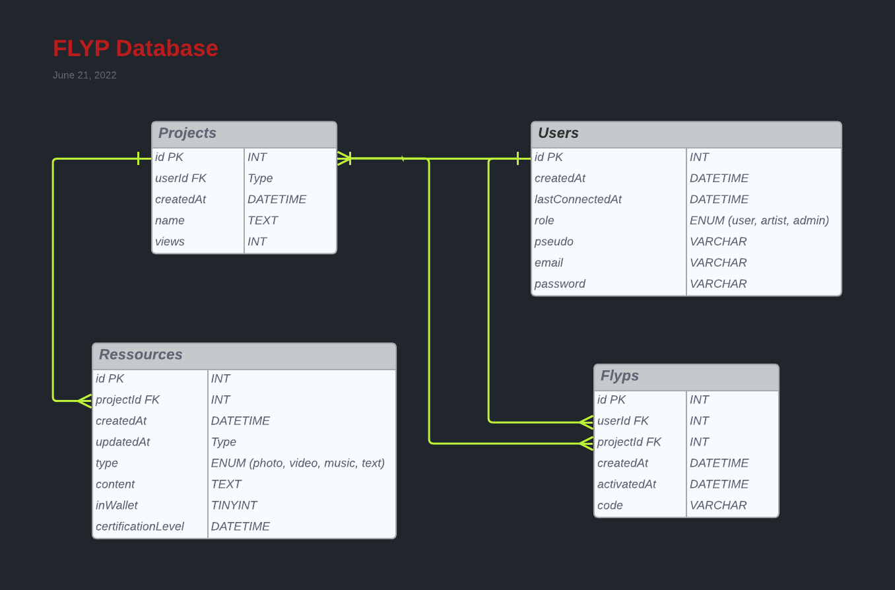

## Project

This project is used to handle the **FLYP** platform.

## Database

## Setup & Use

### Project Initialization

- In VSCode, install plugin **Prettier - Code formatter**
- Run command `npm run setup`
- In the **backend** folder, run the `node migrate.js` command to initialize the database.

### Available Commands (npm)

- `setup` : Install frontend and backend dependenciesas well as husky for CI/CD lint.
- `dev` : Starts both applications (frontend + backend)
- `dev-front` : Starts the React application only
- `dev-back` : Starts the Express backend application onley
- `lint` : Runs linters on both frontend and backend.
- `fix` : Fixes linters errors for both frontend and backend.